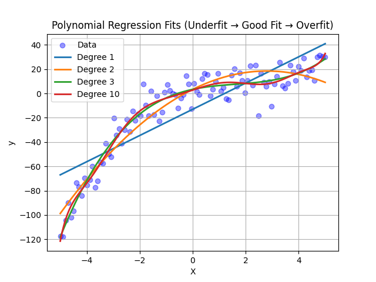

# Project 3 — Polynomial Regression (sklearn)

A comprehensive implementation of Polynomial Regression using scikit-learn. Polynomial feature expansion enables linear models to capture curved, non-linear relationships while maintaining the simplicity and efficiency of linear regression.

## 📋 Table of Contents

- [Overview](#overview)
- [Features](#features)
- [Requirements](#requirements)
- [Project Structure](#project-structure)
- [Usage](#usage)
- [Concepts Covered](#concepts-covered)
- [Why Polynomial Regression?](#why-polynomial-regression)
- [Synthetic Data Generation](#synthetic-data-generation)
- [Polynomial Feature Expansion](#polynomial-feature-expansion)
- [Degree Selection & Model Behavior](#degree-selection--model-behavior)
- [Evaluation Metrics & Results](#evaluation-metrics--results)
- [Real-World Example: Hours Studied](#real-world-example-hours-studied)
- [Real-World Applications](#real-world-applications)
- [Visualizations](#visualizations)
- [Final Takeaways](#final-takeaways)
- [Next Steps](#next-steps)

## 🎯 Overview

Polynomial Regression allows us to model curved relationships by expanding input features into polynomial terms:

```
x, x², x³, ..., xᵈ
```

Using these expanded features, a simple `LinearRegression` model can learn non-linear curves while still being easy to train and understand. This project demonstrates how different polynomial degrees affect model performance, illustrating concepts of underfitting, optimal fit, and overfitting.

## ✨ Features

- **Polynomial Feature Expansion**: Uses `PolynomialFeatures` to transform features into polynomial terms
- **Multiple Degrees Compared**: Trains models with degrees 1, 2, 3, and 10 to demonstrate underfitting and overfitting
- **Fast Training**: Leverages scikit-learn's analytical OLS solution
- **Comprehensive Evaluation**: Computes Train/Test MSE and R² scores for model comparison
- **Visualization**: Generates plots showing fitted curves for all degrees
- **Reproducible Data**: Synthetic cubic dataset with fixed random seed for consistent results

## 📦 Requirements

- Python 3.7+
- NumPy
- scikit-learn
- Matplotlib (for visualization)

## 📂 Project Structure

```
project3_polynomial_regression/
│
├── data.py        # Synthetic cubic dataset generation
├── train.py       # Trains models for degrees 1, 2, 3, 10
├── eval.py        # Computes MSE, R² on train/test sets
├── plots.py       # Generates fitted-curve visualizations
├── plots.png      # Saved visualization (generated by plots.py)
└── README.md      # Project documentation
```

## 🚀 Usage

### 1️⃣ Train All Models

```bash
python train.py
```

This script trains polynomial regression models for degrees 1, 2, 3, and 10, displaying coefficients and intercepts for each.

### 2️⃣ Evaluate Model Performance

```bash
python eval.py
```

This script computes and displays:
- Train MSE and Test MSE for each degree
- R² Score for model comparison
- Performance metrics to identify best model

### 3️⃣ Visualize Fitted Curves

```bash
python plots.py
```

This script generates and displays plots showing:
- Original data points
- Fitted curves for each polynomial degree
- Visual comparison of underfitting vs. overfitting

## 📚 Concepts Covered

### What You Learn in This Project

- ✔ **Polynomial Feature Expansion**: How `PolynomialFeatures` transforms `X → [x, x², x³, …]`
- ✔ **Meaning of Polynomial Degrees**: Understanding how degree affects model flexibility
- ✔ **Synthetic Data Generation**: Why synthetic data is useful for learning and experimentation
- ✔ **Training Multiple Models**: Comparing different polynomial degrees (1, 2, 3, 10)
- ✔ **Understanding Metrics**: Train MSE, Test MSE, R² Score, and their interpretation
- ✔ **Underfitting vs. Overfitting**: Recognizing model complexity issues visually and numerically
- ✔ **Plotting & Visualization**: How to view model behavior and detect overfitting

## 🔍 Why Polynomial Regression?

### The Problem with Linear Regression

Regular Linear Regression fits:

```
y = θx + b   # straight line
```

But real-world problems are often **curved, not straight**.

### Real-World Examples

| Scenario | Relationship | Why Non-Linear? |
|----------|--------------|-----------------|
| **Hours studied → Exam marks** | Curved | More study increases marks, but later plateaus (diminishing returns) |
| **Speed → Fuel efficiency** | U-shaped curve | Too slow or too fast = bad mileage |
| **Temperature → Electricity usage** | Curved | Very hot or very cold → high AC/heater usage |

**Polynomial regression captures such curves** by expanding features into polynomial terms, allowing linear models to fit non-linear relationships.

## 🧪 Synthetic Data Generation

### Data Generation Formula

```python
X = np.linspace(-5, 5, 100)
y = 0.5*X**3 - 2*X**2 + 3*X + 5 + noise
```

### Why Synthetic Data?

Using synthetic data is perfect for learning because:

- ✅ **We control the true mathematical function** - We know the exact relationship
- ✅ **We know the relationship is cubic** - Makes it easy to validate model performance
- ✅ **We can simulate real-world noise** - Adds realism while maintaining control
- ✅ **It helps observe underfitting and overfitting clearly** - Controlled environment for learning

### Why `np.linspace(-5, 5, 100)`?

Creates 100 evenly spaced values between -5 and 5. This symmetric range is ideal because:

- Cubic curves change direction
- Helps visualize S-shape behavior
- Provides good coverage of the function's behavior

### Why `np.random.seed(42)`?

Guarantees same noise every run, ensuring:

- ✅ Training results stay consistent
- ✅ Easier debugging
- ✅ Reproducible learning experience

## 🔧 Polynomial Feature Expansion

### Core Concept

**Example Transformation:**

If:
```
X = [2]
```

Degree = 3 creates:
```
[2, 4, 8]  # [x, x², x³]
```

### Implementation in sklearn

```python
poly = PolynomialFeatures(degree=degree, include_bias=False)
X_poly = poly.fit_transform(X)
```

### Why `include_bias=False`?

Because `LinearRegression()` already adds its own bias term. Otherwise, we would add a duplicate column of 1s, which is redundant.

## 📊 Degree Selection & Model Behavior

### Why We Train 4 Models (degree = 1, 2, 3, 10)

Each degree gives a different level of flexibility:

| Degree | Shape | Behavior |
|--------|-------|----------|
| 1 | Straight line | ❌ Too simple (underfit) |
| 2 | Parabola | 👍 Fairly good |
| 3 | Cubic curve | ⭐ Best fit |
| 10 | Highly wiggly curve | ⚠️ Overfits |

This project teaches **model selection** - choosing the right complexity for your data.

### How We Choose the Best Degree

We compare **test MSE** (not training MSE) because it measures generalization.

**Example Results:**

| Degree | Train MSE | Test MSE | R² Score | Result |
|--------|-----------|----------|----------|--------|
| 1 | 326.64 | 455.62 | 0.712 | ❌ Underfit |
| 2 | 137.29 | 143.74 | 0.909 | 👍 Good |
| 3 | 81.60 | 60.22 | 0.962 | ⭐ **BEST** |
| 10 | 74.93 | 81.73 | 0.948 | ⚠️ Overfit |

**Final Model = Degree 3**

It generalizes best and closely matches the true cubic pattern. Notice that degree 10 has lower training MSE but higher test MSE - a classic sign of overfitting.

## 📈 Evaluation Metrics & Results

### Key Metrics Explained

- **Train MSE**: Mean Squared Error on training data (how well model fits training set)
- **Test MSE**: Mean Squared Error on test data (how well model generalizes)
- **R² Score**: Coefficient of determination (proportion of variance explained, 0 to 1)

### Interpreting Results

- **Low Train MSE, High Test MSE** → Overfitting (model memorized training data)
- **High Train MSE, High Test MSE** → Underfitting (model too simple)
- **Low Train MSE, Low Test MSE** → Good fit (model generalizes well)

## 🔥 Real-World Example: Hours Studied → Polynomial Features

### Scenario Setup

Let's say:
```
X = hours studied
```

If degree = 3:
```
X_poly = [hours, hours², hours³]
```

### Feature Interpretation

**Why these features?**

- **hours**: Basic linear increase
- **hours²**: Captures plateau or diminishing returns
- **hours³**: Models early struggle + later improvement

This models **REAL human learning** more accurately than a simple straight line.

### Detailed Example: Student Study Hours

**Suppose a student studied 3 hours:**

```
X = [3]
```

If we use degree = 3, `PolynomialFeatures` transforms it into:

```
X_poly = [3, 3², 3³]
X_poly = [3, 9, 27]
```

### Feature Meaning (Real Interpretation)

#### 1️⃣ Feature 1 — x = 3

"More hours → more marks" (basic linear growth)

But real learning is **not perfectly linear**.

#### 2️⃣ Feature 2 — x² = 9

Represents **diminishing returns**:

- From 0 → 3 hours: improvement is sharp
- From 3 → 6 hours: improvement is slower
- Eventually plateaus

So the square gives the curve shape.

**If hours = 5 →** `x² = 25` (stronger curvature, bigger bending effect)

#### 3️⃣ Feature 3 — x³ = 27

Represents **early struggle + late acceleration**:

- In beginning: learning is slow
- After understanding basics: learning accelerates

So cubic terms model more **S-shaped patterns**.

**If hours = 5 →** `x³ = 125` (strong effect on S-curve)

### Comparison: Two Students

| Student | Hours Studied (x) | x² | x³ |
|---------|-------------------|----|----|
| A | 3 | 9 | 27 |
| B | 5 | 25 | 125 |

**Interpretation:**

- Student B studied more (5 hours)
- Their `x² = 25` → indicates stronger bend (approaching plateau or diminishing returns)
- Their `x³ = 125` → indicates acceleration (late learning improvement)

The polynomial model uses these three signals to predict marks.

### Why Not Just Use Hours (x)? Why x² and x³?

Because **human learning is NON-LINEAR**:

- **Day 1–3**: Big jumps! Concepts are new → steep learning
- **Day 4–6**: Plateau → diminishing returns
- **Later**: Understanding clicks → big improvement again

A straight line cannot model this. **Polynomial regression can.**

### Prediction Example

**Assume the trained model learned:**

```
y = 4*x - 1.5*x² + 0.3*x³ + 50
```

**Now apply it:**

**For x = 3 hours:**
```
y = 4(3) - 1.5(9) + 0.3(27) + 50
  = 12 - 13.5 + 8.1 + 50
  = 56.6 marks
```

**For x = 5 hours:**
```
y = 4(5) - 1.5(25) + 0.3(125) + 50
  = 20 - 37.5 + 37.5 + 50
  = 70 marks
```

**See the difference?**

From 3 → 5 hours: only +2 hours, but marks jump from 56.6 → 70.

Because cubic model captures **late surge in learning** - the non-linear acceleration that linear models miss.

### Summary Table

| Hours | x | x² | x³ | Real Meaning |
|-------|---|----|----|--------------|
| 3 | 3 | 9 | 27 | Moderate study |
| 5 | 5 | 25 | 125 | Stronger curve + late improvement |

## 🌍 Real-World Applications

Polynomial regression is used in:

- ✔ **Student learning curves** - Modeling academic performance over time
- ✔ **Sales growth patterns** - Forecasting business growth
- ✔ **Medicine dose-response** - Understanding drug effectiveness
- ✔ **Manufacturing cost curves** - Production cost optimization
- ✔ **Price–demand curves** - Economics and pricing strategies
- ✔ **Biological growth** - Height vs. age, population growth
- ✔ **Marketing ROI curves** - Return on investment analysis
- ✔ **Stock smoothing** - Short-term trend analysis

**All these relationships are non-linear** and benefit from polynomial feature expansion.

## 🖼️ Visualizations

The `plots.py` script generates curves for all degrees, helping visualize:

- **Degree 1** → Underfitting (straight line misses curvature)
- **Degree 3** → Natural, smooth shape (best fit)
- **Degree 10** → Overfitting (wiggly curve captures noise)



This visualization clearly shows:
- How degree 1 underfits the data
- How degree 3 captures the true pattern
- How degree 10 overfits with excessive wiggles

## 🏁 Final Takeaways

You now understand:

- ✔ **Why polynomial regression is powerful** - Captures non-linear relationships
- ✔ **How linear models learn curves** - Using x², x³ features
- ✔ **How underfitting & overfitting appear** - Both in metrics and plots
- ✔ **Why degree 3 was the best choice** - Optimal balance of complexity
- ✔ **How sklearn solves regression instantly** - Once features are expanded
- ✔ **How polynomial regression relates to:**
  - Neural networks (they also create non-linear transforms)
  - Kernel methods
  - Feature engineering
  - Bias–variance tradeoff

## 🌟 Next Steps

### Project 4 — Ridge & Lasso Regression

Regularization solves:

- **Overfitting** (especially degree 10 models)
- **Large coefficients** (unstable predictions)
- **Wiggly curves** (poor generalization)

**You will learn:**

- **Ridge Regression (L2)** - Penalizes large coefficients
- **Lasso Regression (L1)** - Can zero out coefficients (feature selection)
- **How regularization smooths the curve** - Reduces overfitting
- **How to tune regularization strength (alpha)** - Finding optimal balance

Regularization techniques help control model complexity and prevent overfitting, especially useful for high-degree polynomial models.

---

**Note**: This project is part of a Machine Learning Specialization series designed to build foundational understanding through hands-on implementation. It builds on Projects 1 and 2, extending linear models to non-linear relationships while maintaining training efficiency.
