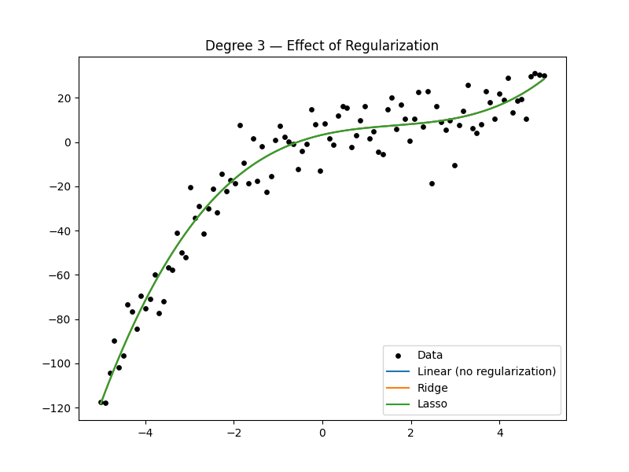
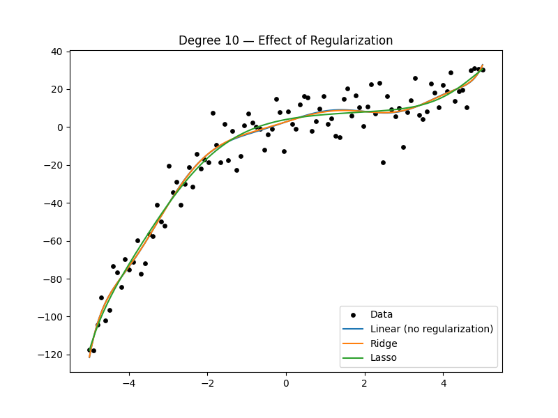

# Project 4 — Ridge & Lasso Regression (Regularization)

This project extends Polynomial Regression by adding Regularization, which reduces overfitting, stabilizes coefficients, and improves generalization. We implement Linear Regression (baseline), Ridge Regression (L2), and Lasso Regression (L1), and compare them on degrees 1, 3, and 10 polynomial models.

## 📋 Table of Contents

- [Overview](#overview)
- [Why Ridge & Lasso?](#why-ridge--lasso)
- [What is Overfitting?](#what-is-overfitting)
- [Ridge Regression (L2 Regularization)](#ridge-regression-l2-regularization)
- [Lasso Regression (L1 Regularization)](#lasso-regression-l1-regularization)
- [Understanding Alpha (α)](#understanding-alpha-α)
- [Synthetic Noise Options](#synthetic-noise-options)
- [Project Structure & Design](#project-structure--design)
- [Results & Interpretation](#results--interpretation)
- [Evaluation Results](#evaluation-results)
- [ConvergenceWarning Explanation](#convergencewarning-explanation)
- [Visualizations](#visualizations)
- [Usage](#usage)
- [Project Structure](#project-structure)
- [Final Takeaways](#final-takeaways)

## 🎯 Overview

This project demonstrates how regularization techniques (Ridge and Lasso) solve overfitting problems in high-degree polynomial models. By penalizing large coefficients, these methods improve model generalization and stability.

**Models Compared:**
- Linear Regression (baseline, no regularization)
- Ridge Regression (L2 regularization)
- Lasso Regression (L1 regularization)

**Polynomial Degrees Tested:**
- Degree 1 (simple linear)
- Degree 3 (optimal cubic)
- Degree 10 (high complexity, prone to overfitting)

## 🔍 Why Ridge & Lasso?

Polynomial models with high degree (like degree 10) tend to:

- ✔ **Overfit** - Memorize training data instead of learning patterns
- ✔ **Learn very large coefficients** - Unstable and unreliable predictions
- ✔ **Become unstable** - Small data changes cause large prediction changes
- ✔ **Memorize noise** - Fit random variations instead of true signal
- ✔ **Perform poorly on test data** - Poor generalization to new data

**Regularization solves this by penalizing large weights**, encouraging the model to use smaller coefficients and focus on the most important features.

## ⚠️ What is Overfitting? Why Does It Happen?

### The Problem

For degree=10 polynomial, your model creates features:

```
x, x², x³, ... x¹⁰
```

These features allow the model to "wiggle" too much and fit noise rather than the underlying pattern.

### Symptoms of Overfitting

**Your Results:**

| Model | Train MSE | Test MSE | Behavior |
|-------|-----------|----------|----------|
| Linear (deg 10) | 74.93 | 81.73 | ❌ Overfit |
| Ridge | — | 78.98 | ✔ Slightly better |
| Lasso | — | 64.50 | ⭐ Best improvement |

**Key Indicators:**
- Large gap between train and test error
- Very large coefficient values
- Model fits training data too closely
- Poor performance on unseen data

## 🛡️ Ridge Regression (L2 Regularization)

### Formula

**Minimize:**

```
Loss = MSE + α * (sum of squared coefficients)
```

L2 shrinks coefficients smoothly toward zero but rarely makes them exactly zero.

### Effects

- ✅ **Reduces overfitting** - Prevents model from memorizing training data
- ✅ **Keeps all features** - All coefficients remain non-zero
- ✅ **Makes the curve less wiggly** - Smoother, more stable predictions
- ✅ **Prevents huge coefficients** - Constrains model complexity

### Real-World Example

**Predicting house prices with many correlated features:**

- Bedrooms, area, location quality, school rating, crime rate, proximity to amenities...

Some features will explode without regularization. **Ridge keeps them under control** by penalizing the sum of squared coefficients, ensuring no single feature dominates the model.

## ⚡ Lasso Regression (L1 Regularization)

### Formula

**Minimize:**

```
Loss = MSE + α * (sum of absolute coefficients)
```

L1 forces some coefficients to become exactly zero, performing automatic feature selection.

### Effects

- ✅ **Performs feature selection** - Automatically removes irrelevant features
- ✅ **Produces sparse models** - Many coefficients become zero
- ✅ **Removes irrelevant polynomial terms** - Simplifies high-degree models
- ✅ **Stabilizes high-degree models** - Prevents overfitting through sparsity

### Real-World Example

**Medical datasets with 200+ biomarkers:**

Lasso automatically picks the important biomarkers by zeroing others. This is crucial when you have:
- Many potential features
- Unknown which are relevant
- Need interpretable models
- Want to avoid overfitting

**Lasso provides automatic feature selection** by setting irrelevant coefficients to zero.

## 🎛️ Understanding Alpha (α)

### What is Alpha?

Alpha controls the **strength of regularization**:

| α small | α large |
|---------|--------|
| Weak penalty | Strong penalty |
| Model flexible | Coefficients shrunk hard |
| Risk of overfit | Risk of underfit |

### Why Different Values?

**Ridge can tolerate larger α:**

- Because L2 shrinks smoothly
- Coefficients approach zero gradually
- Less aggressive feature removal

**Lasso needs smaller α:**

- Because L1 can kill features too aggressively
- Coefficients can jump to zero suddenly
- Too high α removes too many features

**In this project:**
- Ridge: `alpha=1.0`
- Lasso: `alpha=0.1`

### Selecting Alpha

💡 **Best Practice:** Use Cross-Validation (GridSearchCV) → picks best α automatically.

```python
from sklearn.model_selection import GridSearchCV

# Example: Finding optimal alpha
alphas = [0.01, 0.1, 1.0, 10.0, 100.0]
grid = GridSearchCV(Ridge(), {'alpha': alphas}, cv=5)
grid.fit(X_train, y_train)
best_alpha = grid.best_params_['alpha']
```

## 🔬 Synthetic Noise Options

### Option A:
```python
noise = np.random.normal(0, 10, size=100)
```

Normal distribution with mean 0, standard deviation 10.

### Option B:
```python
noise = np.random.randn(100) * 10
```

Same exact distribution.

**➡ Both produce Gaussian noise with std=10.**

Just two ways of writing it. `np.random.randn()` generates standard normal (mean=0, std=1), so multiplying by 10 gives std=10.

## 🏗️ Project Structure & Design

### Why No `.predict()` Inside `train.py`?

Because `train.py` only fits the model. Predictions belong in:

- **`eval.py`** → Evaluation and metrics
- **`plots.py`** → Visualization

**This separation keeps the project clean** and follows best practices:
- Single responsibility principle
- Easier to maintain and debug
- Clear workflow: train → evaluate → visualize

## 📊 Results & Interpretation

### Training Results (Coefficients)

#### Degree 1

Ridge and Lasso almost identical to Linear → **not much to regularize.**

Low-degree models are already simple, so regularization has minimal effect.

#### Degree 3

All three models very similar → **cubic model not overfitting.**

The optimal degree (3) naturally fits the data well without needing regularization.

#### Degree 10

**This is where regularization helps:**

| Model | Behavior |
|-------|----------|
| Linear | Huge, unstable coefficients |
| Ridge | Coefficients shrink slightly |
| Lasso | Many coefficients reduced drastically → removes useless terms |

**Lasso even produced zeros/near-zero values → feature selection.**

Lasso's ability to set coefficients to zero makes it particularly effective for high-degree polynomials, automatically removing unnecessary complexity.

## 📈 Evaluation Results

### Which is Best?

**Your eval results:**

#### === Degree 1 ===

```
Linear   R²: 0.712
Ridge    R²: 0.712
Lasso    R²: 0.712
```

**➡ No difference.** Low-degree model already simple. Regularization unnecessary.

#### === Degree 3 ===

```
Linear   R²: 0.962
Ridge    R²: 0.962
Lasso    R²: 0.962
```

**➡ Cubic model is naturally strong → no regularization needed.**

The optimal degree matches the true data pattern, so all models perform equally well.

#### === Degree 10 ===

```
Linear   MSE: 81.73
Ridge    MSE: 78.98
Lasso    MSE: 64.50
```

**➡ Lasso best because it reduces overfitting by removing useless polynomial terms.**

**Key Insights:**
- Linear (no regularization) performs worst on high-degree models
- Ridge provides moderate improvement by shrinking coefficients
- Lasso provides best improvement by removing irrelevant features entirely

## ⚠️ ConvergenceWarning — Why It Happens?

### The Issue

Lasso uses **coordinate descent** optimization. If:

- Some features are huge
- Alpha too small
- Polynomial degree high

...then the solver struggles to converge.

### Fixes

1. **Scale data** - Normalize features to similar ranges
2. **Increase max_iter** - Allow more iterations for convergence
3. **Increase alpha** - Stronger regularization helps convergence

```python
# Example fix
lasso = Lasso(alpha=0.1, max_iter=2000)
```

### Is It a Problem?

**But the warning is normal for high-degree polynomials.**

The model still works; it just means the optimization didn't fully converge. For practical purposes, the results are usually acceptable.

## 🖼️ Visualizations

The project generates plots comparing regularization effects:

**Place these two images in your project folder:**

```
project4_ridge_lasso/
│── plot4.png
│── plot4_1.png
```

**Add them to README:**





**What the plots show:**
- **plot4.png**: Comparison of fitted curves for Linear, Ridge, and Lasso on degree 3 and 10 models
- **plot4_1.png**: Visualization of how coefficients shrink with regularization

These visualizations clearly demonstrate:
- How regularization smooths wiggly curves
- How Lasso removes unnecessary features (sparsity)
- How Ridge shrinks coefficients smoothly
- The difference between L1 and L2 regularization effects

## 🚀 Usage

### 1️⃣ Train Models

```bash
python train.py
```

Trains Ridge and Lasso models for degrees 1, 3, and 10, displaying coefficients for each.

**Output:**
- Coefficients for each model and degree
- Comparison of how regularization affects coefficients

### 2️⃣ Evaluate Performance

```bash
python eval.py
```

Evaluates Linear, Ridge, and Lasso models on train/test splits, computing MSE and R² scores.

**Output:**
- Train and test MSE for each model
- R² scores for comparison
- Performance metrics across all degrees

### 3️⃣ Visualize Regularized Curves

```bash
python plots.py
```

Generates plots showing:
- Original data points
- Fitted curves for Linear, Ridge, and Lasso
- Visual comparison of regularization effects

**Displays:**
- Degree 3 comparison (where all models perform similarly)
- Degree 10 comparison (where regularization makes a clear difference)

## 📂 Project Structure

```
project4_ridge_lasso/
│
├── data.py          # Synthetic cubic dataset generation
├── train.py         # Trains Ridge and Lasso models
├── eval.py          # Evaluates and compares all three models
├── plots.py         # Generates visualization plots
├── plot4.png        # Ridge vs Lasso comparison plot
├── plot4_1.png      # Coefficient shrinkage visualization
└── README.md        # Project documentation
```

### File Descriptions

- **`data.py`**: Generates synthetic cubic data with noise for reproducible experiments
- **`train.py`**: Trains Ridge and Lasso models, displays coefficients
- **`eval.py`**: Comprehensive evaluation comparing Linear, Ridge, and Lasso with train/test splits
- **`plots.py`**: Creates visualizations showing regularization effects on fitted curves

## 🏁 Final Takeaways

- ✔ **Linear Regression fails for complex curves** - High-degree polynomials overfit without regularization
- ✔ **Ridge prevents overly large coefficients** - L2 regularization smooths and stabilizes models
- ✔ **Lasso removes unnecessary features** - L1 regularization performs automatic feature selection
- ✔ **Regularization improves generalization** - Both methods reduce overfitting and improve test performance
- ✔ **Best method depends on dataset** - Ridge for correlated features, Lasso for feature selection
- ✔ **For degree-10 models, Lasso worked best for you** - Feature selection was more effective than coefficient shrinkage for this problem

### Key Lessons

1. **Regularization is essential for high-complexity models** - Prevents overfitting
2. **L1 vs L2 have different strengths** - Choose based on your needs
3. **Alpha tuning is crucial** - Use cross-validation to find optimal values
4. **Visualization helps understanding** - Plots make regularization effects clear
5. **Model selection matters** - Sometimes simpler models (degree 3) outperform complex ones (degree 10)

---

**Note**: This project is part of a Machine Learning Specialization series. It builds on Projects 1-3, introducing regularization as a crucial technique for controlling model complexity and preventing overfitting in polynomial regression.
