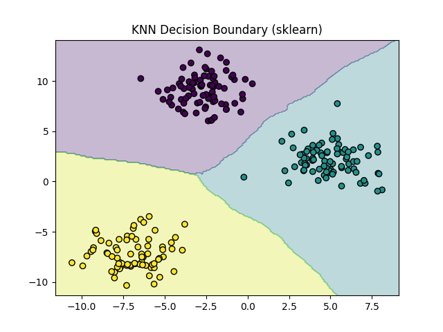

# Project 10 — KNN Classification using sklearn

A comprehensive implementation of K-Nearest Neighbors (KNN) classification using scikit-learn, demonstrating how to use production-ready ML libraries for distance-based, non-parametric learning.

## 📋 Table of Contents

- [Overview](#overview)
- [Features](#features)
- [Requirements](#requirements)
- [Project Structure](#project-structure)
- [Usage](#usage)
- [Concepts Covered](#concepts-covered)
- [Evaluation Metrics](#evaluation-metrics)
- [Example Results](#example-results)
- [FAQ](#faq)
- [Next Steps](#next-steps)

## 🎯 Overview

This project implements K-Nearest Neighbors classification using scikit-learn's `KNeighborsClassifier`, providing a production-ready approach to distance-based learning. This project complements Project 9 (KNN from scratch) by demonstrating how to use optimized, battle-tested implementations in real-world machine learning systems.

**Key Insight:** KNN does not learn weights. It stores data and decides based on nearest neighbors at prediction time.

## ✨ Features

- **scikit-learn Implementation**: Using `KNeighborsClassifier` for optimized KNN classification
- **Multiclass Classification**: Handling multiple classes with distance-based learning
- **Distance-Based Decision Boundaries**: Visualizing classification regions based on nearest neighbors
- **Comprehensive Evaluation**: Multiple metrics including accuracy, precision, recall, and F1-score
- **Decision Boundary Visualization**: Plotting of KNN classification boundaries
- **Comparison Ready**: Can be compared with scratch implementation from Project 9

## 📦 Requirements

- Python 3.7+
- NumPy
- Matplotlib (for visualization)
- scikit-learn

## 📂 Project Structure

```
project10_knn_classification_sklearn/
│
├── data.py               # Synthetic dataset generation and train/test split
├── train.py              # Model training script using sklearn
├── eval.py               # Model evaluation with comprehensive metrics
├── plot.py               # Decision boundary visualization
├── knn.png               # Generated visualization
└── README.md             # Project documentation
```

## 🚀 Usage

### Training the Model

```bash
python train.py
```

This script will:
- Load and split the dataset into training and test sets
- Initialize the KNN model with specified parameters (K=5, Euclidean distance)
- Train the model (which stores the training data)
- Display training confirmation message

### Evaluating the Model

```bash
python eval.py
```

This script will:
- Load the trained model
- Make predictions on test data
- Calculate comprehensive evaluation metrics
- Display accuracy and detailed classification report

### Visualizing Decision Boundaries

```bash
python plot.py
```

This script will:
- Generate decision boundary plots
- Visualize data points and classification regions
- Display the KNN decision boundaries learned by the model
- Save the visualization for reference

## 📚 Concepts Covered

### What You Learn in This Project

- **Using KNeighborsClassifier**: How to use scikit-learn's KNN implementation
- **Multiclass Classification**: Handling classification problems with 3+ classes
- **Distance-Based Decision Boundaries**: Understanding how KNN creates classification regions
- **Comparison with Scratch KNN**: Seeing the differences between custom and library implementations

### scikit-learn KNN Implementation

**Key Parameters:**

```python
from sklearn.neighbors import KNeighborsClassifier

model = KNeighborsClassifier(
    n_neighbors=5,        # K = 5 (number of neighbors)
    metric="euclidean"    # Distance metric (Euclidean distance)
)
```

**Parameters Explained:**

- **`n_neighbors` (K)**: Number of neighbors to consider for classification
  - Common values: 3, 5, 7
  - Affects the smoothness of decision boundaries
  - Smaller K = more complex boundaries, larger K = smoother boundaries

- **`metric`**: Distance metric to use
  - `"euclidean"`: Standard Euclidean distance (default)
  - `"manhattan"`: Manhattan distance (L1 norm)
  - `"minkowski"`: Generalization of Euclidean and Manhattan
  - Others: `"hamming"`, `"cosine"`, etc.

### Key Differences: Project 9 vs. Project 10

**🧠 Big Picture (VERY IMPORTANT)**

| Project | What You Learned |
|---------|------------------|
| Project 9 | How KNN works internally (from scratch implementation) |
| Project 10 | How KNN is used in real ML systems (scikit-learn) |

This is exactly how Andrew Ng wants you to learn: understand the fundamentals by implementing from scratch, then use production-ready libraries in practice.

**Scratch Implementation (Project 9):**
- Educational: Builds deep understanding of the algorithm
- Custom: Full control over implementation details
- NumPy-based: Manual distance calculations and neighbor finding

**scikit-learn Implementation (Project 10):**
- Production-ready: Optimized with efficient data structures (e.g., KD-tree, Ball tree)
- Convenient: Simple API, fewer lines of code
- Feature-rich: Built-in evaluation metrics and utilities
- Efficient: Optimized for large datasets with advanced algorithms

### Why KNN Doesn't Learn Weights

**Fundamental Concept:**

Unlike parametric methods (linear regression, logistic regression, neural networks), KNN is a **non-parametric**, **instance-based** learning algorithm:

- **No training phase**: There's no optimization or weight learning
- **Storage**: The model simply stores all training data
- **Lazy learning**: All computation happens at prediction time
- **Distance-based**: Predictions are made by finding K nearest neighbors and taking majority vote

**Comparison:**

| Aspect | Parametric (e.g., Logistic Regression) | Non-Parametric (KNN) |
|--------|----------------------------------------|----------------------|
| Training | Learns weights through optimization | Stores training data |
| Parameters | Fixed set of weights/biases | All training instances |
| Prediction Speed | Fast (matrix multiplication) | Slower (distance calculations) |
| Memory | Stores only parameters | Stores all training data |

### Dataset

**Synthetic Data with make_blobs:**

This project uses synthetic multiclass data to clearly demonstrate:
- Distance-based learning behavior
- Effect of K on decision boundaries
- Non-parametric classification patterns

The dataset configuration:
- 300 samples total
- 3 classes (multiclass classification)
- 2 features (for easy visualization)
- Well-separated clusters for clear learning

**Train/Test Split:**
- 80% training data (240 samples)
- 20% test data (60 samples)
- Fixed random state for reproducibility

## 📊 Evaluation Metrics

### Accuracy

**Definition:**

```
Accuracy = (Number of correct predictions) / (Total number of predictions)
```

**Interpretation:**
- Measures overall correctness of predictions
- Range: 0.0 to 1.0 (higher is better)
- Simple and intuitive metric

### Classification Report

scikit-learn provides a comprehensive classification report including:

**Per-Class Metrics:**

- **Precision**: Out of all instances predicted as a class, how many actually belong to that class?
- **Recall**: Out of all instances that actually belong to a class, how many did we correctly identify?
- **F1-Score**: Harmonic mean of precision and recall, providing a balanced measure

**Aggregate Metrics:**

- **Macro Average**: Unweighted mean of per-class metrics (treats all classes equally)
- **Weighted Average**: Mean of per-class metrics weighted by support (class frequency)
- **Support**: Number of actual occurrences of each class in the test set

### When to Use Which Metric?

- **Accuracy**: Good for balanced datasets (like our synthetic data)
- **Precision**: Important when false positives are costly
- **Recall**: Important when false negatives are costly
- **F1-Score**: Good balance when both precision and recall matter
- **Per-Class Metrics**: Essential when classes are imbalanced

## 📊 Example Results

### Training Output

```
KNN model trained using sklearn
```

The training is essentially instant since KNN just stores the training data (no optimization needed).

### Evaluation Output

```
Accuracy: 1.0

Classification Report:
              precision    recall  f1-score   support

           0       1.00      1.00      1.00        18
           1       1.00      1.00      1.00        17
           2       1.00      1.00      1.00        25

    accuracy                           1.00        60
   macro avg       1.00      1.00      1.00        60
weighted avg       1.00      1.00      1.00        60
```

### Interpretation

**Perfect Performance (1.0 across all metrics):**

- **Accuracy: 1.0**: All 60 test instances were correctly classified
- **Perfect Precision (1.0)**: No false positives for any class
- **Perfect Recall (1.0)**: No false negatives for any class
- **Perfect F1-Score (1.0)**: Optimal balance between precision and recall

**Why Perfect Scores?**

- Clean, well-separated synthetic data from `make_blobs`
- Balanced classes (18, 17, 25 samples per class in test set)
- Appropriate K value (5) for the dataset size and structure
- No noise or outliers that would confuse the model

**Support Column:**
- Class 0: 18 test samples
- Class 1: 17 test samples
- Class 2: 25 test samples
- Total: 60 test samples

### Decision Boundaries Visualization

The visualization shows:
- Data points colored by their true class
- Decision boundaries determined by KNN
- Classification regions based on nearest neighbors



**Characteristics of KNN Decision Boundaries:**
- Piecewise linear or curved regions
- Dependent on the K value (K=5 in this project)
- More complex with smaller K, smoother with larger K
- Regions are based on local neighborhood structure

## ❓ FAQ

### 1. Why use scikit-learn's KNN instead of the scratch implementation?

**Advantages of scikit-learn:**
- **Optimized**: Uses efficient data structures (KD-tree, Ball tree) for fast neighbor search
- **Scalable**: Handles large datasets better than naive implementations
- **Feature-rich**: Built-in metrics, cross-validation, grid search
- **Production-ready**: Well-tested and maintained
- **Convenient**: Simple API, less code to write

**When to use scratch:**
- Learning purposes (understanding the algorithm)
- Custom requirements not supported by scikit-learn
- Educational projects (like Project 9)

### 2. How does scikit-learn optimize KNN?

scikit-learn uses advanced data structures to speed up neighbor search:

- **KD-Tree**: Efficient for low-dimensional spaces (< 20 dimensions)
- **Ball Tree**: Better for higher-dimensional spaces or non-Euclidean metrics
- **Brute Force**: Used when data is sparse or for custom metrics

These optimizations make KNN much faster than naive distance calculations to all points.

### 3. How do I choose the right K value?

**Methods:**
1. **Cross-validation**: Try different K values and pick the best
2. **Rule of thumb**: Start with K = √n (where n is number of training samples)
3. **Odd values**: Use odd K to avoid ties in binary classification
4. **Domain knowledge**: Consider what makes sense for your problem

**In this project:** K = 5 is a good default choice, balancing between overfitting (small K) and oversmoothing (large K).

### 4. What distance metrics are available?

Common metrics in scikit-learn:
- **`euclidean`**: Standard straight-line distance (default, used in this project)
- **`manhattan`**: Sum of absolute differences (L1 norm)
- **`minkowski`**: Generalization parameterized by p
- **`hamming`**: For categorical/binary data
- **`cosine`**: For text/document similarity

Choose based on your data type and problem requirements.

### 5. Why do we get perfect scores (1.0) on synthetic data?

Synthetic data from `make_blobs` is:
- **Clean**: No noise or outliers
- **Well-separated**: Clear boundaries between classes
- **Balanced**: Relatively equal class distribution
- **Simple**: Only 2 features, making classification easier

This makes it easy for KNN to achieve perfect performance. Real-world data is messier and typically yields lower (but still meaningful) scores.

### 6. How does KNN handle ties in voting?

With even K values or when classes tie in votes:
- scikit-learn uses the class with lower index (first encountered)
- Better practice: Use odd K values to avoid ties
- Can also use weighted voting (closer neighbors have more weight) via `weights="distance"`

### 7. Should features be scaled for KNN?

**Yes!** Feature scaling is crucial for KNN because:
- Euclidean distance is affected by feature scales
- Features with larger values dominate distance calculations
- Example: If one feature ranges 0-1 and another 0-1000, the second dominates

**Solution:** Use standardization (z-score) or normalization (min-max scaling) before training.

### 8. How does this compare to Project 9 (scratch implementation)?

| Aspect | Project 9 (Scratch) | Project 10 (sklearn) |
|--------|---------------------|----------------------|
| Implementation | Custom NumPy code | scikit-learn library |
| Speed | Slower (naive distance) | Faster (optimized) |
| Complexity | ~30 lines of code | ~5 lines of code |
| Learning Value | Deep understanding | Production usage |
| Scalability | Limited | Better for large data |
| Features | Basic | Advanced (metrics, etc.) |

Both achieve similar results, but scikit-learn is typically faster and more feature-rich for production use.

## 🌍 Real-World Use Cases

KNN (via scikit-learn) is used in various applications:

1. **Recommendation Systems**: "Users who liked X also liked Y" (collaborative filtering)
2. **Medical Diagnosis**: Classifying patients based on similar cases
3. **Image Classification**: Classifying images based on similar images (for small-medium datasets)
4. **Pattern Recognition**: Handwriting recognition, facial recognition
5. **Fraud Detection**: Identifying fraudulent transactions based on similar patterns
6. **Text Classification**: Classifying documents based on similar documents
7. **Gene Expression Analysis**: Classifying samples based on similar gene patterns

**Note:** For very large-scale problems, KNN may be replaced by more efficient parametric methods or approximate nearest neighbor algorithms.

## 🌟 Next Steps

**What's Next (Logical Order):**

**Project 11 — SVM (Support Vector Machine)**

The next project will focus on:
- **Margin**: Understanding maximum margin classification
- **Kernel Trick**: Learning how to handle non-linear boundaries
- **Why SVM beats KNN sometimes**: Understanding the trade-offs
- **Support Vectors**: Learning what makes SVM efficient
- **Hyperplanes**: Understanding decision boundaries in high dimensions

**Key Comparison:**

While KNN is simple and intuitive, SVM offers:
- Better generalization with limited training data
- More efficient for large datasets (fewer support vectors vs. all training points)
- Ability to handle high-dimensional spaces better
- Explicit margin maximization

---

**Note**: This project is part of a Machine Learning Specialization series designed to build foundational understanding through hands-on implementation. You've now learned both the fundamentals (Project 9) and the production usage (Project 10) of KNN classification!
