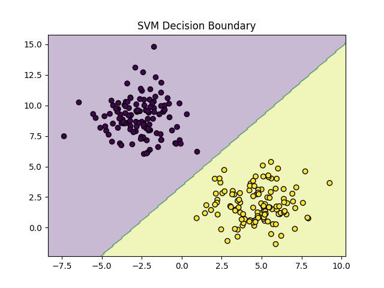

# Project 11 — Support Vector Machine (SVM) Classifier using sklearn

A comprehensive implementation of Support Vector Machine (SVM) classification using scikit-learn, demonstrating how SVM finds the optimal separating boundary between classes through maximum margin separation.

## 📋 Table of Contents

- [Overview](#overview)
- [Features](#features)
- [Requirements](#requirements)
- [Project Structure](#project-structure)
- [Usage](#usage)
- [Concepts Covered](#concepts-covered)
- [Evaluation Metrics](#evaluation-metrics)
- [Example Results](#example-results)
- [FAQ](#faq)
- [Next Steps](#next-steps)

## 🎯 Overview

SVM is a powerful classification algorithm that focuses on maximum margin separation, making it robust and effective in many real-world problems. This project implements an SVM classifier using scikit-learn and visualizes how SVM finds the best separating boundary between classes.

Unlike other classifiers that may fit the data closely, SVM finds the decision boundary that maximizes the margin (distance) between classes, leading to better generalization and robustness to outliers.

## ✨ Features

- **scikit-learn Implementation**: Using `SVC` (Support Vector Classifier) with linear kernel
- **Maximum Margin Classification**: Understanding how SVM optimizes for maximum separation
- **Support Vectors**: Visualizing and understanding support vectors
- **Decision Boundary Visualization**: Plotting SVM decision boundary and margins
- **Model Persistence**: Saving and loading trained models
- **Synthetic Data Generation**: Using `make_blobs` for clear, separable datasets

## 📦 Requirements

- Python 3.7+
- NumPy
- Matplotlib (for visualization)
- scikit-learn
- joblib (for model persistence)

## 📂 Project Structure

```
project11_svm_classifier/
│
├── data.py               # Synthetic dataset generation using make_blobs
├── train.py              # Model training script
├── eval.py               # Model evaluation and accuracy calculation
├── plot.py               # Decision boundary visualization
├── svm_model.pkl         # Saved trained model (generated after training)
├── svm.png               # Generated visualization
└── README.md             # Project documentation
```

## 🚀 Usage

### Training the Model

```bash
python train.py
```

This script will:
- Load and split the dataset into training and test sets
- Initialize the SVM classifier with linear kernel
- Train the model to find the optimal separating hyperplane
- Display learned weights and bias
- Save the trained model to `svm_model.pkl`

### Evaluating the Model

```bash
python eval.py
```

This script will:
- Load the trained model from `svm_model.pkl`
- Make predictions on test data
- Calculate and display accuracy score

### Visualizing Decision Boundaries

```bash
python plot.py
```

This script will:
- Load the trained model
- Generate decision boundary plots
- Visualize data points and the SVM separation line
- Display the classification regions

## 📚 Concepts Covered

### 🎯 What You Learn in This Project

- **What SVM is and why it is powerful**: Understanding the fundamental concepts
- **How SVM differs from Logistic Regression**: Key differences in approach and use cases
- **What margin and support vectors mean**: Core SVM concepts explained
- **How synthetic data is generated and why we use it**: Understanding data generation for learning
- **How SVM is trained using sklearn**: Practical implementation details
- **How to evaluate classification accuracy**: Performance measurement
- **How to visualize the decision boundary**: Understanding model behavior visually

### 🧠 SVM — Explained Simply (Like a Child)

Imagine two groups of people standing in a playground.

You want to draw a line between them so that:
- Nobody is too close to the line
- The line stays as far as possible from both groups

**SVM chooses the safest line** — the line with the maximum gap (margin).

The closest people to the line are called **support vectors**. They "support" where the line is drawn.

### Core Idea of SVM

**SVM tries to find:**

The line (or plane) that separates classes with the largest possible margin.

**Why margin matters?**

- **Larger margin → better generalization**: The model is more likely to perform well on unseen data
- **Less sensitive to noise**: Small variations in data won't drastically change the boundary
- **More confident predictions**: Points further from the boundary have more confident classifications

**Mathematical Formulation:**

For a linear SVM, the decision boundary is:
```
w₁x₁ + w₂x₂ + b = 0
```

Where:
- **w** (weights): Defines the direction of the separating line
- **b** (bias): Shifts the line position
- **Margin**: Distance between the decision boundary and the nearest data points

### 🆚 SVM vs. Logistic Regression

| Feature | Logistic Regression | SVM |
|---------|-------------------|-----|
| **Output** | Probability (0–1) | Class decision |
| **Decision boundary** | Fits probability curve | Maximizes margin |
| **Focus** | Likelihood | Separation |
| **Sensitive to outliers** | Yes | Less |
| **Works well with small data** | Moderate | ✅ Very good |
| **Used when** | Need probabilities | Need strong boundaries |

**Key Insight:**
- **Logistic Regression answers**: "What's the probability?"
- **SVM answers**: "Which side are you on?"

**When to Use Each:**

- **Use Logistic Regression when**: You need probability estimates, interpretability is important, or you have large datasets
- **Use SVM when**: You have small to medium datasets, need robust boundaries, or classes are clearly separable

### 🧪 Synthetic Data — What & Why?

**What is synthetic data?**

Data that we artificially generate using math, not collected from the real world.

**Why we use it?**

- **Easy to visualize**: 2D synthetic data can be plotted and understood visually
- **Fully controlled**: We can control class separation, noise, and distributions
- **Perfect for learning algorithms**: Focus on understanding the algorithm, not data preprocessing

**How it's generated (in this project):**

We use `make_blobs` from scikit-learn:

```python
from sklearn.datasets import make_blobs

X, y = make_blobs(
    n_samples=300,
    centers=2,          # Binary classification
    cluster_std=1.5,    # Standard deviation of clusters
    random_state=42     # For reproducibility
)
```

This creates:
- **Clearly separable clusters**: Two distinct groups of data points
- **Labeled data**: Each point belongs to class 0 or class 1
- **Ideal for testing classifiers**: Perfect for understanding how SVM works

**Parameters Explained:**

- **`n_samples=300`**: Total number of data points
- **`centers=2`**: Number of clusters (classes) - binary classification
- **`cluster_std=1.5`**: Standard deviation of clusters (controls spread)
- **`random_state=42`**: Seed for reproducibility

### SVM Implementation Details

**scikit-learn SVC Parameters:**

```python
from sklearn.svm import SVC

model = SVC(kernel="linear", C=1.0)
```

**Key Parameters:**

- **`kernel="linear"`**: Uses linear kernel (straight line separation)
  - Other options: `"rbf"` (non-linear), `"poly"` (polynomial), `"sigmoid"`
  - Linear kernel is suitable for linearly separable data

- **`C=1.0`**: Regularization parameter
  - Controls trade-off between maximizing margin and minimizing classification error
  - **Small C**: Larger margin, more misclassifications allowed (softer margin)
  - **Large C**: Smaller margin, fewer misclassifications allowed (harder margin)
  - Default is 1.0

**Model Attributes:**

After training, the model contains:
- **`model.coef_`**: Weights (w) defining the separating hyperplane
- **`model.intercept_`**: Bias (b) shifting the hyperplane
- **`model.support_vectors_`**: The data points that define the margin

### Support Vectors

**What are Support Vectors?**

Support vectors are the data points closest to the decision boundary. They are crucial because:
- They define the margin
- Only these points influence the decision boundary
- Removing non-support vectors doesn't change the boundary

**Why "Support"?**

These vectors "support" the margin boundaries. The optimal hyperplane depends only on these points, not on all training data.

### Margin

**Definition:**

The margin is the distance between the decision boundary and the nearest data points from each class.

**Maximum Margin:**

SVM finds the hyperplane that maximizes this margin, leading to:
- Better generalization to new data
- More robust predictions
- Reduced risk of overfitting

## 📊 Evaluation Metrics

### Accuracy

**Definition:**

```
Accuracy = (Number of correct predictions) / (Total number of predictions)
```

**Interpretation:**
- Measures overall correctness of predictions
- Range: 0.0 to 1.0 (higher is better)
- 1.0 means 100% accuracy (all predictions correct)

**When Accuracy is Appropriate:**

- Balanced datasets (equal class distribution)
- Equal importance of all classes
- Quick performance assessment

**Limitations:**

- Can be misleading with imbalanced classes
- Doesn't show per-class performance
- Doesn't distinguish between types of errors

For this project's clean, balanced synthetic data, accuracy is a suitable metric.

## 📊 Example Results

### Training Output

```
SVM model trained and saved.
Weights: [[ 0.66433712 -0.58457765]]
Bias: [1.99259138]
```

**Interpretation:**

- **Weights**: `[[ 0.66433712 -0.58457765]]`
  - Defines the direction of the separating line
  - The line equation is: `0.66433712 * x₁ - 0.58457765 * x₂ + 1.99259138 = 0`
  
- **Bias**: `[1.99259138]`
  - Shifts the line position in feature space
  - Adjusts the decision boundary offset

- **Meaning**: SVM learned a separating line that optimally separates the two classes with maximum margin

### Evaluation Output

```
Accuracy: 1.0
```

**Interpretation:**

- **Perfect separation**: 100% of test instances were correctly classified
- **Why perfect?**: 
  - Synthetic data is clean and clearly separable
  - Classes are well-separated with no overlap
  - Linear SVM is excellent at margin-based separation for such data
- **Real-world note**: Real datasets typically show lower (but still meaningful) accuracy

### Decision Boundary Visualization

The visualization shows:
- Data points colored by their true class
- SVM decision boundary (the optimal separating line)
- Classification regions (areas assigned to each class)



**What to Look For:**

- **Clear separation**: The boundary cleanly separates the two classes
- **Maximum margin**: The boundary is positioned to maximize distance from nearest points
- **Support vectors**: The points closest to the boundary (typically shown with special markers in some visualizations)
- **Linear boundary**: With linear kernel, the boundary is a straight line

### 📊 Your Results — Explained

**✔ Accuracy = 1.0**

This is expected because:
- Data is synthetic and well-controlled
- Classes are clearly separable with no overlap
- SVM is excellent at margin-based separation
- Linear kernel is appropriate for linearly separable data

**✔ Learned weights & bias**

These define the equation of the separating line:

```
w₁x₁ + w₂x₂ + b = 0
```

Where:
- `w₁ = 0.66433712`
- `w₂ = -0.58457765`
- `b = 1.99259138`

The line equation determines:
- **Which class a new point belongs to**: Points on one side are class 0, on the other side are class 1
- **Confidence of prediction**: Points further from the line have more confident classifications

## 🌍 Real-World Uses of SVM

SVM is widely used in various applications:

- **Gmail spam detection**: Classifying emails as spam or not spam
- **Face recognition**: Identifying faces in images
- **Text classification**: Categorizing documents and articles
- **Bioinformatics**: Gene classification and protein structure prediction
- **Handwriting recognition**: Recognizing handwritten digits and characters
- **Credit risk detection**: Classifying loan applicants as high or low risk
- **Image classification**: Classifying images into categories
- **Medical diagnosis**: Classifying diseases based on symptoms

**SVM is especially powerful when:**

- **Data is small but high-dimensional**: SVM handles high-dimensional spaces well
- **Clear separation exists**: Works best when classes can be separated
- **You want robustness**: Less sensitive to outliers than many other algorithms
- **Memory efficiency matters**: Only stores support vectors, not all training data

## ❓ FAQ

### 1. What makes SVM different from other classifiers?

**Key differences:**
- **Maximum margin focus**: SVM explicitly maximizes the margin, not just fits the data
- **Support vectors only**: Only support vectors matter, not all training data
- **Kernel trick**: Can handle non-linear boundaries through kernel functions
- **Robust to outliers**: Margin maximization makes it less sensitive to outliers

### 2. What is the C parameter and how do I choose it?

**C is the regularization parameter:**
- **Small C (e.g., 0.1)**: Softer margin, allows more misclassifications, larger margin
- **Large C (e.g., 10)**: Harder margin, fewer misclassifications allowed, smaller margin
- **Default (1.0)**: Good starting point

**How to choose:**
- Start with default (C=1.0)
- Use cross-validation to find optimal C
- If overfitting: decrease C
- If underfitting: increase C

### 3. What are kernels and when should I use them?

**Kernels allow non-linear boundaries:**
- **Linear**: Straight line separation (used in this project)
- **RBF (Radial Basis Function)**: Handles non-linear, curved boundaries
- **Polynomial**: Polynomial decision boundaries
- **Sigmoid**: Similar to neural network activation

**When to use:**
- **Linear**: Data is linearly separable (like our synthetic data)
- **RBF**: Most common non-linear choice, works well for many problems
- **Polynomial**: When you have domain knowledge about polynomial relationships

### 4. Why do we get perfect accuracy (1.0) on synthetic data?

Perfect accuracy occurs because:
- **Clean data**: No noise or outliers
- **Clear separation**: Classes are well-separated with no overlap
- **Appropriate kernel**: Linear kernel matches the data structure
- **Optimal parameters**: Default parameters work well for this data

Real-world data typically shows lower but meaningful accuracy.

### 5. How does SVM handle non-linearly separable data?

For non-linearly separable data:
- **Use non-linear kernels** (RBF, polynomial) to map data to higher dimensions where it becomes linearly separable
- **Adjust C parameter** to allow soft margins (some misclassifications)
- **Kernel trick**: Computes in higher dimensions without explicitly mapping data

### 6. What are support vectors and why are they important?

**Support vectors are:**
- The data points closest to the decision boundary
- The only points that determine the margin and boundary
- Usually a small subset of training data

**Why important:**
- **Efficiency**: Model only needs to store support vectors, not all data
- **Interpretability**: Show which points are "hard" to classify
- **Robustness**: Model depends only on boundary cases, not all data

### 7. How does SVM compare to KNN (Project 9-10)?

| Aspect | SVM | KNN |
|--------|-----|-----|
| **Memory** | Stores only support vectors | Stores all training data |
| **Prediction Speed** | Fast (simple equation) | Slower (distance calculations) |
| **Robustness** | Less sensitive to outliers | More sensitive to noise |
| **Decision Boundary** | Global optimization | Local neighborhood |
| **Best for** | Small-medium datasets, clear separation | Large datasets, non-parametric needs |

### 8. Should features be scaled for SVM?

**Yes!** Feature scaling is crucial for SVM because:
- SVM uses distance-based calculations (margin depends on distances)
- Features with larger scales dominate the margin calculation
- Without scaling, SVM may not find the optimal boundary

**Solution:** Use standardization (z-score) or normalization (min-max scaling) before training.

### 9. How does SVM work for multiclass classification?

SVM is inherently binary, but extends to multiclass using:
- **One-vs-Rest (OvR)**: Train one SVM per class vs. all others
- **One-vs-One (OvO)**: Train one SVM for each pair of classes
- scikit-learn automatically uses OvR for multiclass problems

### 10. Is SVM suitable for large datasets?

**Limitations:**
- Training time grows significantly with dataset size
- Memory requirements can be high for very large datasets

**Alternatives for large data:**
- **LinearSVC**: Faster linear SVM implementation
- **SGDClassifier**: Stochastic gradient descent for linear SVMs
- Other algorithms (Random Forest, Neural Networks) may be more suitable

## 🌟 Next Steps

### 🏁 Final Takeaways

You now understand:

- **What SVM is**: Maximum margin classifier
- **Why margin is important**: Better generalization and robustness
- **How SVM differs from Logistic Regression**: Different objectives and use cases
- **Why SVM works well in real-world classification**: Robust and efficient
- **How to train, evaluate, and visualize an SVM**: Practical implementation
- **How synthetic data helps learning**: Understanding algorithms without data complexity

**This completes the CLASSIFICATION MODULE of your ML Specialization.**

### 🚀 What's Next?

**Next module options:**

1. **Neural Networks (from scratch)**
   - Build neural networks from the ground up
   - Understand backpropagation and activation functions
   - Implement multi-layer networks

2. **Decision Trees & Random Forests**
   - Learn tree-based classification methods
   - Understand ensemble learning
   - Implement bagging and boosting

3. **Unsupervised Learning (K-Means, PCA)**
   - Clustering algorithms
   - Dimensionality reduction
   - Pattern discovery without labels

**Recommended Path:**

After completing classification, neural networks provide a natural progression as they extend many concepts you've learned (activation functions like sigmoid/softmax, gradient descent, etc.).

---

**Note**: This project is part of a Machine Learning Specialization series designed to build foundational understanding through hands-on implementation. You've now mastered multiple classification algorithms, from parametric (Logistic Regression, Softmax) to non-parametric (KNN) to maximum margin methods (SVM)!
