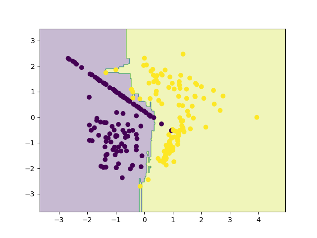

# Project 13 — Random Forest Classifier

A comprehensive implementation of Random Forest Classifier using scikit-learn, demonstrating one of the most powerful and widely used classical machine learning algorithms for tabular data.

## 📋 Table of Contents

- [Overview](#overview)
- [Features](#features)
- [Requirements](#requirements)
- [Project Structure](#project-structure)
- [Usage](#usage)
- [Concepts Covered](#concepts-covered)
- [How Random Forest Works](#how-random-forest-works)
- [Why Random Forest is Needed](#why-random-forest-is-needed)
- [Model Configuration](#model-configuration)
- [Synthetic Dataset](#synthetic-dataset)
- [Evaluation Metrics](#evaluation-metrics)
- [Example Results](#example-results)
- [Visualization](#visualization)
- [Comparison with Other Models](#comparison-with-other-models)
- [Real-World Applications](#real-world-applications)
- [Why Andrew Ng Teaches This](#why-andrew-ng-teaches-this)
- [Key Takeaways](#key-takeaways)
- [Next Steps](#next-steps)

## 🎯 Overview

Random Forest is one of the most powerful and widely used classical machine learning algorithms for tabular data. It improves upon Decision Trees by using many trees together instead of relying on just one.

**Simple Explanation:**
- A Decision Tree is like one person making a decision
- A Random Forest is like asking 100 people and taking a vote
- 👉 One tree can be wrong
- 👉 Many trees together are much more reliable

**Random Forest = Many Decision Trees + Majority Voting**

## ✨ Features

- **Ensemble Learning**: Combines multiple decision trees
- **Bagging Algorithm**: Bootstrap Aggregation for robust predictions
- **Overfitting Control**: Built-in regularization through tree diversity
- **High Accuracy**: Superior performance compared to single decision trees
- **Stability**: Less sensitive to data variations
- **Synthetic Data**: Controlled dataset for learning and visualization
- **Model Persistence**: Saves trained model for reuse
- **Decision Boundary Visualization**: Visual representation of classification regions
- **Comprehensive Evaluation**: Accuracy and detailed classification report

## 📦 Requirements

- Python 3.7+
- scikit-learn
- NumPy
- Matplotlib (for visualization)
- joblib (for model persistence)

## 📂 Project Structure

```
project13_random_forest/
│
├── data.py          # Generate synthetic dataset
├── train.py         # Train and save model
├── eval.py          # Evaluate performance
├── plot.py          # Decision boundary visualization
├── RF.png           # Saved plot
└── README.md        # Project documentation
```

## 🚀 Usage

### Training the Model

```bash
python train.py
```

This script will:
- Generate synthetic data
- Split data into train/test sets
- Train the Random Forest classifier
- Save the trained model
- Display training confirmation

### Evaluating the Model

```bash
python eval.py
```

This script will:
- Load the trained model
- Make predictions on test data
- Calculate accuracy
- Display detailed classification report

### Visualizing Decision Boundary

```bash
python plot.py
```

This script will:
- Load the trained model
- Generate decision boundary plot
- Save visualization as `RF.png`

## 📚 Concepts Covered

### What is Random Forest? (Simple Explanation)

**Random Forest = Many Decision Trees + Majority Voting**

The algorithm:
1. Randomly samples data (with replacement) - **Bootstrapping**
2. Trains a decision tree on each sample
3. Limits tree depth to avoid memorization
4. Each tree makes a prediction
5. Final prediction = majority vote

This is called **Bagging (Bootstrap Aggregation)**.

## 🌲 How Random Forest Works

### High-Level Process

1. **Randomly sample data** (with replacement)
2. **Train a decision tree** on each sample
3. **Limit tree depth** to avoid memorization
4. **Each tree makes a prediction**
5. **Final prediction = majority vote**

### Key Mechanisms

**Bootstrapping:**
- Each tree sees different data samples
- Samples are drawn with replacement
- Creates diversity among trees

**Feature Randomness:**
- Each tree may consider different features
- Reduces correlation between trees
- Improves ensemble performance

**Majority Voting:**
- Each tree votes for a class
- Final prediction is the most common vote
- Reduces variance and overfitting

## ❓ Why Random Forest is Needed

### Problem with Decision Trees

**Decision Trees:**
- ❌ Overfit easily
- ❌ Memorize training data
- ❌ Very sensitive to small data changes

### How Random Forest Fixes This

**Random Forest:**
- ✔ Trains many trees
- ✔ Each tree sees different data (bootstrapping)
- ✔ Each tree sees different features
- ✔ Final prediction = majority vote

**This leads to:**
- ✅ Higher accuracy
- ✅ Better generalization
- ✅ Much less overfitting

## ⚙️ Model Configuration

**We train the model using:**

```python
RandomForestClassifier(
    n_estimators=100,
    max_depth=5,
    random_state=42
)
```

**Parameter Meaning:**
- `n_estimators=100` → 100 decision trees
- `max_depth=5` → prevents overfitting
- `random_state=42` → reproducible results

## 🧪 Synthetic Dataset

**We use synthetic data generated with `make_classification`.**

**Why synthetic?**
- Controlled environment
- Known class boundaries
- Perfect for learning & visualization

**Dataset properties:**
- 300 data points
- 2 features (easy to plot)
- 2 classes (binary classification)
- Train/Test split = 80/20

**This simulates real-world structured data like:**
- Customer profiles
- Credit risk data
- Medical measurements

## 📊 Evaluation Metrics

The project evaluates the following metrics:

- **Accuracy**: Overall correctness of predictions
- **Precision**: How many predicted positives were correct
- **Recall**: How many actual positives were found
- **F1-score**: Balance of precision & recall

This is industry-standard evaluation.

## 📈 Example Results

### Training Output

```
Random Forest trained and saved.
```

### Evaluation Output

```
Accuracy: 0.95
```

**Classification Report:**

| Class | Precision | Recall | F1-score |
|-------|-----------|--------|----------|
| 0     | 0.94      | 0.97   | 0.95     |
| 1     | 0.97      | 0.93   | 0.95     |

**Interpretation:**
- ✔ High accuracy (95%)
- ✔ Balanced precision & recall
- ✔ Much better than a single decision tree

## 📊 Visualization

The decision boundary is saved as `RF.png`.



**What the plot shows:**
- Smooth boundaries
- Less noise than Decision Tree
- Strong generalization
- Better separation of classes

## ⚖️ Comparison with Other Models

| Feature | Logistic Regression | Decision Tree | Random Forest |
|---------|---------------------|---------------|---------------|
| Model Type | Linear | Rule-based | Ensemble |
| Handles Non-linearity | ❌ No | ✅ Yes | ✅✅ Yes |
| Overfitting | Low | High | Very Low |
| Accuracy | Medium | Medium | High |
| Interpretability | Medium | High | Medium |
| Industry Usage | High | Medium | Very High |

## 🌍 Real-World Applications

Random Forest is heavily used in industry for:

**🏦 Banking & Finance**
- Credit risk scoring
- Fraud detection

**🏥 Healthcare**
- Medical diagnosis
- Risk assessment

**🛒 Business Analytics**
- Customer churn prediction
- Tabular business data analysis

**🏆 Competitions**
- Kaggle competitions (baseline model)

**Andrew Ng's advice:**
> "If you don't know what model to try first on tabular data — use Random Forest."

## 🧠 Why Andrew Ng Teaches This After Decision Trees

**Andrew Ng's teaching order:**
1. Linear models
2. Logistic regression
3. Decision trees
4. **Random Forest** ← You are here
5. Boosting (XGBoost)
6. Neural Networks

**Because Random Forest:**
- Builds ensemble intuition
- Fixes tree weaknesses
- Bridges classical ML → advanced ML
- Is extremely practical

## ✅ Key Takeaways

You now understand:

- ✔ Ensemble learning
- ✔ Bagging (bootstrap aggregation)
- ✔ Reducing overfitting
- ✔ Stability vs variance
- ✔ Industry-grade ML modeling

## 🚀 Next Steps

**Project 14 — XGBoost / Gradient Boosting Classifier**

The next project will focus on:
- More powerful than Random Forest
- Sequential learning
- Industry & Kaggle standard
- Strong regularization

**After that → Neural Networks 🚀**

---

**Note**: This project is part of a Machine Learning Specialization series designed to build foundational understanding through hands-on implementation.
