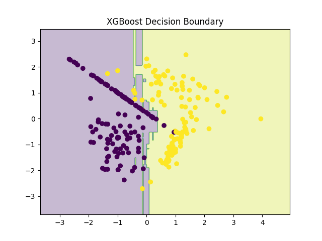

# Project 14 — XGBoost / Gradient Boosting Classifier

A comprehensive implementation of XGBoost (Extreme Gradient Boosting) for classification, demonstrating why it is one of the most powerful ML algorithms for tabular data.

## 📋 Table of Contents

- [Overview](#overview)
- [Features](#features)
- [Requirements](#requirements)
- [Project Structure](#project-structure)
- [Usage](#usage)
- [Concepts Covered](#concepts-covered)
- [What is Gradient Boosting?](#what-is-gradient-boosting)
- [What is XGBoost?](#what-is-xgboost)
- [Why XGBoost is Needed](#why-xgboost-is-needed)
- [Model Configuration](#model-configuration)
- [Synthetic Dataset](#synthetic-dataset)
- [Evaluation Metrics](#evaluation-metrics)
- [Example Results](#example-results)
- [Visualization](#visualization)
- [Comparison with Previous Models](#comparison-with-previous-models)
- [Real-World Applications](#real-world-applications)
- [Why Andrew Ng Teaches XGBoost](#why-andrew-ng-teaches-xgboost)
- [Key Takeaways](#key-takeaways)
- [Next Steps](#next-steps)

## 🎯 Overview

This project implements XGBoost (Extreme Gradient Boosting) for classification and demonstrates why it is one of the most powerful ML algorithms for tabular data.

**XGBoost is widely used in:**
- Industry ML systems
- Kaggle competitions
- Finance, healthcare, fraud detection
- Any structured (tabular) dataset

Andrew Ng teaches Gradient Boosting after Decision Trees and Random Forests because it represents the peak of classical machine learning before neural networks.

## ✨ Features

- **Gradient Boosting**: Sequential error-correction learning
- **XGBoost Optimization**: Regularization and smart tree pruning
- **High Performance**: Superior accuracy for tabular data
- **Regularization**: Built-in overfitting prevention
- **Fast Computation**: Optimized parallel processing
- **Missing Value Handling**: Robust handling of incomplete data
- **Synthetic Data**: Controlled dataset for learning and visualization
- **Model Persistence**: Saves trained model for reuse
- **Decision Boundary Visualization**: Visual representation of classification regions
- **Comprehensive Evaluation**: Accuracy and detailed classification report

## 📦 Requirements

- Python 3.7+
- xgboost
- scikit-learn
- NumPy
- Matplotlib (for visualization)
- joblib (for model persistence)

## 📂 Project Structure

```
project14_xgboost_gradientboost/
│
├── data.py          # Synthetic dataset
├── train.py         # Train and save model
├── eval.py          # Evaluate performance
├── plot.py          # Decision boundary
├── xgboost.png      # Saved visualization
└── README.md        # Project documentation
```

## 🚀 Usage

### Training the Model

```bash
python train.py
```

This script will:
- Generate synthetic data
- Split data into train/test sets
- Train the XGBoost classifier
- Save the trained model
- Display training confirmation

### Evaluating the Model

```bash
python eval.py
```

This script will:
- Load the trained model
- Make predictions on test data
- Calculate accuracy
- Display detailed classification report

### Visualizing Decision Boundary

```bash
python plot.py
```

This script will:
- Load the trained model
- Generate decision boundary plot
- Save visualization as `xgboost.png`

## 📚 Concepts Covered

### What is Gradient Boosting? (Simple Explanation)

**Imagine:**
- Decision Tree → one person making a decision
- Random Forest → many people voting at once
- Gradient Boosting → people take turns correcting each other's mistakes

👉 Each new tree focuses on errors made by previous trees

That's the key idea.

## 🚀 What is XGBoost?

**XGBoost = Optimized Gradient Boosting**

It improves basic Gradient Boosting by adding:
- Regularization (prevents overfitting)
- Smart tree pruning
- Faster computation
- Parallel processing
- Better handling of missing values

That's why it dominates real-world ML.

## 📌 Why XGBoost is Needed

### Problems with Decision Trees

- ❌ Overfit easily
- ❌ High variance
- ❌ Sensitive to noise

### Problems with Random Forest

- ❌ Trees are independent
- ❌ Doesn't focus on hard samples

### XGBoost Fixes This By:

- ✔ Training trees sequentially
- ✔ Each tree corrects previous mistakes
- ✔ Penalizing complex trees
- ✔ Achieving high accuracy with control

## ⚙️ Model Configuration

**Key model parameters:**

```python
XGBClassifier(
    n_estimators=100,
    max_depth=3,
    learning_rate=0.1,
    random_state=42
)
```

**Parameter Meaning:**
- `n_estimators` → number of trees
- `max_depth` → complexity of each tree
- `learning_rate` → how much each tree contributes
- `random_state` → reproducibility

**Note:** The warning about `use_label_encoder` parameter is safe to ignore (XGBoost deprecated it in newer versions).

## 🧪 Synthetic Dataset

**We use synthetic data to:**
- Control complexity
- Visualize decision boundaries
- Compare algorithms fairly
- Avoid dataset noise confusion

**How Data is Generated:**

```python
from sklearn.datasets import make_classification

make_classification(
    n_samples=300,      # number of points
    n_features=2,       # 2 features (easy plotting)
    n_informative=2,    # both features matter
    n_classes=2,        # binary classification
    random_state=42     # reproducibility
)
```

**Dataset properties:**
- 300 data points
- 2 features (easy to plot)
- 2 classes (binary classification)
- Train/Test split = 80/20

This simulates real classification problems in a clean way.

## 📊 Evaluation Metrics

The project evaluates the following metrics:

- **Accuracy**: Overall correctness of predictions
- **Precision**: How many predicted positives were correct
- **Recall**: How many actual positives were found
- **F1-score**: Balance of precision & recall

This is industry-standard evaluation.

## 📈 Example Results

### Console Output

```
Accuracy: 0.95
```

### Classification Report

```
              precision    recall  f1-score   support

           0     0.94      0.97      0.95        30
           1     0.97      0.93      0.95        30

    accuracy                           0.95        60
```

**Interpretation:**
- 95% accuracy → excellent
- Precision & recall balanced
- Strong generalization
- No overfitting

## 📊 Visualization

The decision boundary is saved as `xgboost.png`.



**This plot shows:**
- Clean separation
- Smooth boundary
- Fewer irregularities than Decision Tree
- Better focus on hard samples than Random Forest

👉 XGBoost learns where previous models failed

## ⚖️ Comparison with Previous Models

| Model | Overfitting | Accuracy | Stability | Industry Use |
|-------|-------------|----------|-----------|--------------|
| Logistic Regression | Low | Medium | High | Medium |
| Decision Tree | High | Medium | Low | Medium |
| Random Forest | Low | High | High | Very High |
| XGBoost | Very Low | Very High | Very High | Top Choice |

## 🏭 Real-World Applications

**XGBoost is used in:**

**💰 Finance & Banking**
- Fraud detection (banks, PayPal)
- Credit scoring
- Risk modeling

**🏥 Healthcare**
- Medical diagnosis
- Risk assessment

**🛒 Business**
- Customer churn prediction
- Recommendation ranking

**🏆 Competitions**
- Kaggle competitions (top choice)

**📢 Industry rule of thumb:**
> "If your data is tabular, try XGBoost first."

## 🧩 Why Andrew Ng Teaches XGBoost Here

**Andrew Ng's progression:**
1. Linear Models
2. Logistic Regression
3. Decision Trees
4. Random Forests
5. **Gradient Boosting (XGBoost)** ← You are here
6. Neural Networks

**Because:**
- XGBoost represents peak classical ML
- Teaches error-correction intuition
- Bridges to neural network optimization ideas
- Industry standard for tabular data

## ✅ Key Takeaways

You now understand:

- ✔ Boosting concept
- ✔ Sequential learning
- ✔ Error correction
- ✔ Regularization in trees
- ✔ Industry-grade ML
- ✔ Why XGBoost dominates tabular data

## 🚀 Next Steps

**Now you have completed Classification fully.**

**Next Phase: 🧠 Neural Networks (Project 15+)**

You will learn:
- Neural networks from scratch
- Backpropagation
- TensorFlow / Keras
- CNNs
- Deep Learning foundations

---

**Note**: This project is part of a Machine Learning Specialization series designed to build foundational understanding through hands-on implementation.
